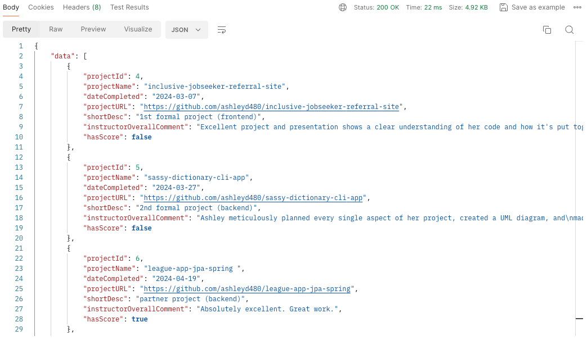
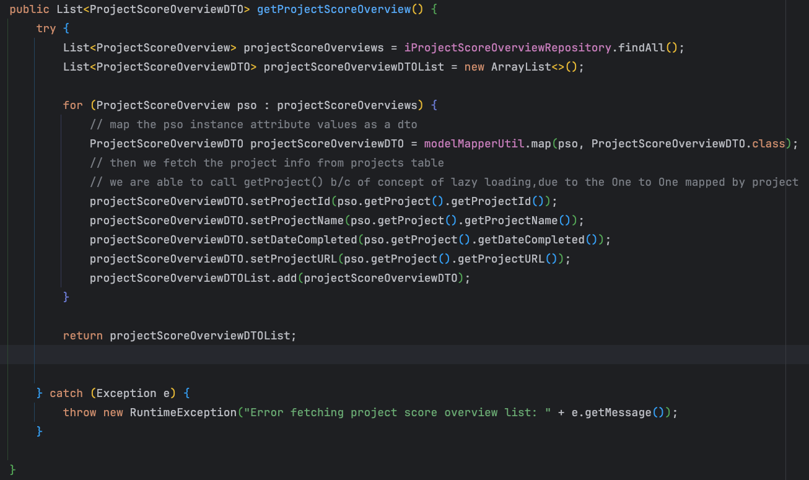

# My Portfolio Backend

---

# Intro

This portfolio was started in my 18th week of coding, 2 weeks after the conclusion of our 16-week bootcamp. The repo here contains the backend codebase, using Java, Spring Boot, Postgres, and psql. As of July 2024, this repo along with the database are  hosted on Heroku. 

---

# Overview

## Purpose
Given my interest in both frontend and backend- as they each respectively appeal to my creative and technical deep-dive side, I decided to make my portfolio fullstack. This portfolio is used to document my metrics through my General Assembly (GA) bootcamp journey, as well as projects and more. This project gave me the opportunity to delve into new topics such as dealing with uploading data to Postgres, Spring Boot mapping with database schema, migrating data to Heroku, and more. 

## Features 
The backend is where the databases for my GA scores, project scores, and more are hosted in Postgres and saved as entities in Spring Boot. The `get mapping` API endpoints are defined in the Controller classes, and a Global Exception handler is used for displaying user-facing error messages for any exceptions that occur. DTOs are used to relay data to the frontend.



Please note that as of 2025, I have migrated away from hosting my backend and have moved my data to frontend arrays for cost efficiency purposes.

## Dependencies
The application utilizes the Spring Boot framework with the following dependencies: Spring Web, Spring Data JPA, and also Lombok.

---

# Table of Contents

1. [Setup](#setup)
   - [Dataset CSV](#dataset-csv)
   - [Create Tables](#create-tables)
      - [Primary and Foreign Keys](#primary-and-foreign-keys)
      - [Join Table](#join-table)
   - [Loading to Postgres](#loading-to-postgres)
      - [Modify Tables](#modify-tables)
2. [Mapping Entity](#mapping-entity)
   - [Annotations](#annotations)
   - [Data Types](#data-types)
   - [Insertable/Updatable](#insertableupdatable)
3. [Functionality](#functionality)
   - [Controllers](#controllers)
   - [Model Mapper](#model-mapper)
4. [Error Handling](#error-handling)
   - [Global Exception Handler](#global-exception-handler)
   - [Helper Method](#helper-method)

---

# Set Up

## Dataset CSV
This project gave me the opportunity to delve into using Spring Boot with existing pre-populated datasets, something we hadn’t yet touched upon in bootcamp class (where we simply worked with `create-update` type formats, feeding dummy data to a blank database). 

With this project, I created CSV files of my bootcamp weekly instructor/mentor scores, my projects list, and the respective project scores. A few notes on the design of my data tables:
- Separate CSVs were made for each project that had scores. This was because each project had different grading criteria; in other words- that would mean a different number of columns and varying column titles. Therefore, there is a table for `capstone_score`, `league_app_score`, etc. 
- `Projects` and `Skills` have a many-to-many relationship. I ended up having to create a join table CSV manually- which would include the `project_id` and which `skill_id` the project is tied to. Without uploading this dataset, there would be no way for the system to know which skills are tied to which project and vice versa. 


## Create Tables

Before we can upload the CSV to Postgres, we need to create the table along with its attributes.
Below is an example of a `CREATE` command that I ran  in Postgres, where the `projectScoresOverview` has a one-one-one with `projectId` from our `projects` table. 

```
CREATE TABLE projectsScoresOverview (
    projectScoreId SERIAL PRIMARY KEY,
    projectId INTEGER REFERENCES projects(projectId),
    projectName VARCHAR(255) NOT NULL,
    blurb TEXT,
    comment TEXT,
    hasScore BOOLEAN
);
```

Note: While creating the tables, I needed to have a data type to represent the instructor/mentor comments, as well as my project descriptions. I used  `varchar` for short strings and `text` for longer blocks of text.

### Primary and Foreign
`SERIAL` and `PRIMARY KEY` are used together to define a column that will automatically generate unique values for each row in a table, with `SERIAL` allowing for the values to auto-increment.  
The foreign key of `projectId` is placed on the `projectScoresOverview` instead of the other way around because:
- We want to ensure that projectScore is associated with a project. 
- Also, this is because of data management too: scores are created/updated after projects. 
- Foreign keys are typically placed on the owning side, which is the side that is created and associated with the other side. In this case, you typically create scores and associate them with projects. 


### Join Table
Here is a screenshot to show the `CREATE` table command for the join table between projects and skills.

  

By using a composite primary key:  `PRIMARY KEY (project_id, skill_id)`, we use the natural relationship between project_id and skill_id to uniquely identify each record in the join table. This approach avoids the need for an additional surrogate key, as each project_id/skill_id combination is already unique. 

## Loading to Postgres
Once the basic table skeletons were created- while loading the datasets to Postgres could have been done with `Insert` commands, that could be prone to error and also time-consuming. I used psql instead to copy the CSVs over. 

Here are the steps taken to copy my CSVs over to my local Postgres database: 
1. Open terminal and run: psql -U postgres -d yourdatabase.
2. Use \copy to import your CSV files into PostgreSQL:

```
\copy project_score_overview(project_id, short_desc, instructor_overall_comment, has_score) FROM '/path/to/your/csv/project-scores-overview.csv' DELIMITER ',' CSV HEADER;  
```

Please note the following when copying: 
- Ensure the column names match exactly (column names in parenthesis).
- PostgreSQL is case sensitive; also make sure that the table name matches exactly, in this case `project_score_overview` is the name of the table in Postgres that we are copying the data too.
- Use CSV HEADER to tell PostgreSQL to ignore the first row of the CSV file because it contains the column names and not actual data.
- Don’t include serial keys in your CSV (PostgreSQL auto-generates these), i.e. you wouldn’t include `projectScoreId`.
- You want to use `\copy` to prevent issue of Postgres permission reading your file


### Modify Tables
After copying the CSV over to to my local database, for any changes I needed to make, I used the following commands: 

- Insert data:  
```
INSERT INTO Projects (column1, column2) VALUES (value1, value2);
```

- Update data:
```
UPDATE Projects SET project_video = 'video_url' WHERE projectname = 'project_name';
```

- Alter table and column names:
```
ALTER TABLE projectsScoresOverview RENAME TO projectScoresOverview;
ALTER TABLE project_score_overview RENAME COLUMN projectScoreId TO project_score
```


## Mapping Entity
Once all the data is written over to Postgres locally, I could then map them over as entities in Spring Boot. 

### Annotations

Here are the annotations I used to make this happen: 

- **@Entity**: This tells Spring Boot that this class is an entity and should be mapped to a table.
- **@Table(name = "project_score_overview")**: This specifies the table name in PostgreSQL. Make sure it matches exactly, including case sensitivity
- **@Id and @GeneratedValue(strategy = GenerationType.IDENTITY)**: These together mark the primary key and specify that its value will be auto-generated.
- **@Column(name = "column_name", length = length_value)**: This maps the class field to a column in the table. The length attribute is added if the column can exceed the default character count length (usually 255). For example, since `short_desc` can be up to 500 characters, I set length = 500
- **@JoinColumn(name = "project_id", referencedColumnName = "project_id")**: Specifies the column (project_id) in the `project_score_overview` table that references the project_id column in the Project table. This ensures that the relationship is correctly established between the two tables.


Also, for the join table for the many-to-many between Projects and Skills, under `Projects`, I added the following:

```
    @ManyToMany(cascade = { CascadeType.ALL })
    @JoinTable(
            name = "projectskills",
            joinColumns = { @JoinColumn(name = "project_id") },
            inverseJoinColumns = { @JoinColumn(name = "skill_id") }
    )

    private List<Skill> skills;

    @OneToOne(mappedBy = "project")
    private ProjectScoreOverview projectsScoreOverview;
    // ProjectScoreOverview owns the foreign key

```

`@JoinTable` is placed on the skills field in the Project entity, which is the owning side of the many-to-many relationship. Skills are created and then associated with projects. 

### Data Types
Some other data-types I learned of while mapping are:
- **BigDecimal** is used in Spring Boot to store precise numbers like prices, mapping to PostgreSQL's `NUMERIC` type- which typically allows you to specify the total number of digits and how many numbers after the decimal point, i.e. NUMERIC (5, 2) 
-  **@Temporal** annotation tells Spring Boot how to save date and time fields in PostgreSQL. In this case, putting `@Temporal(TemporalType.DATE)` renders the date obtained from my Postgres table as “2024-07-05.”
### Insertable/ Updatable
The need for `insertable = false, updatable = false` annotations with our foreign key arises in this case because we are integrating JPA with an existing database schema. (Note: This was not needed in prior projects where we worked with blank databases because JPA handles most mappings and foreign key relationships automatically in those cases). 
 
We used this annotation (and you may see this in the screenshot above) as follows:
- **@OneToOne Relationship**: Use insertable = false, updatable = false on the child entity's (ProjectScoreOverview) @JoinColumn.  

Without insertable = false, updatable = false, JPA might try to manage the project_id column in both Project and ProjectScoreOverview entities. This can lead to conflicts or redundant SQL operations, causing errors.  

```
    @OneToOne
    @JoinColumn(name = "project_id", referencedColumnName = "project_id", insertable = false, updatable = false)
    private Project project;

```

`insertable= false` specifies that the project_id column in the ProjectScoreOverview table  should not be included when inserting new rows into the ProjectScoreOverview table.  
 `updatable=false` specifies that the project_id column should not be included when updating existing rows in the ProjectScoreOverview table.  


-  **@ManyToMany Relationship**: JPA handles the management of the join table automatically, so you typically do not need insertable = false, updatable = false annotations unless there are specific requirements outside of standard behavior.

---

# Functionality


## Controllers
Controllers provide the endpoints that the frontend can call to retrieve various types of scores and project details.
- **KpiScoreController**: handles endpoints for bootcamp scores, project score overview, capstone scores, League App scores, and Spring Backend scores.
- **ProjectController**: manages endpoints related to projects, including fetching all project results and retrieving project details by project ID.

### Builder
The controller level methods return a `ResponseDTO` - which if successful includes the data fetched from the corresponding service. The `ResponseDTO` is annotated with `@Builder` so we can use the `.builder` pattern to set attributes instead of calling `.set`- thus keeping our code DRY.


```
   public ResponseEntity<?> getProjectDetailById (@PathVariable Integer projectId) {
       ProjectDetailDTO projectDetail = projectService.getProjectDetailById(projectId);
        ResponseDTO responseDTO = ResponseDTO.builder()
                    .hasError(false)
                    .data(projectDetail)
                    .status(HttpStatus.OK)
                    .build();
        return ResponseEntity.ok(responseDTO);
        }
```

The `.hasError` attribute is key as it allows us in the frontend to determine whether to render the data or whether to render an error message. 


## Model Mapper 
At the service level, calls are made to the database repositories, and this data is written back as DTOs that I can send to the frontend for `get mapping` requests.  Here are the steps I took to implement this library: 

1. ​​In the configuration class, we define a ModelMapper bean. This makes the ModelMapper instance available for dependency injection. 

```
@Configuration
public class AppConfig {
    @Bean
    public ModelMapper modelMapper() {
        return new ModelMapper();
    }
}
```

2. Next, In the utility class, I inject the ModelMapper bean and provide a method to map entities to DTOs. This method sets the matching strategy to STRICT and enables skipping null values (to only map values to the DTO where the attribute matches, and to avoid mapping null values over to the DTO)(.

```
@Component
public class ModelMapperUtil {

    @Autowired
    ModelMapper modelMapper;

    public <E, D> D map(E entity, Class<D> dtoClass) {
        modelMapper.getConfiguration().setMatchingStrategy(MatchingStrategies.STRICT).setSkipNullEnabled(true);
        return modelMapper.map(entity, dtoClass);
    }
}
```

3. That @Component in Step 2 is what allows us to then inject that method into our service levels, helping us simplify mapping our entity data to DTOs. 

You can see how Model Mapper allows us to map each record from my “project scores” table and map each to a DTO, so we can return a response data of a list of DTO. 



 Then, as `projectScoreOverview` has a foreign key reference to `project_id` on the `projects` table, we are to call `.getProject` to get the associated `project` attributes associated with that record in my `projectScoreOverview` table. (This is referred to as “lazy loading”). 

---

# Error Handling


## Global Exception Handler
The global exception handler class helps to render error messages from exceptions thrown in the app, and also allows these messages to be rendered to users through the builder which sets the message to “.message(exception.getMessage())”. 

- **handleRuntimeException**: Handles runtime exceptions which occur at runtime, such as say when we are trying to get project details by id, but the id does not exist 
- **handleException**: Fallback handler for all other exceptions, ensuring a generic error response for unexpected situations.


## Helper method
I added a helper method error-handle empty returns when I noticed an issue with my database API call in the frontend rendering an empty array (due to some issue in data migration to Heroku). 

As a result of this, I wanted to create a failsafe should this happen again- or a way to render an error message to the user on the frontend (specifically the error message on the frontend would allow the user to know there is a connection issue and it would include a link to view a copy of the data.) This would mean, I would have to set `hasError` to true (as my frontend renders an error message only if `hasError` is true). 

As such, you may see the following helper method in my Utils class which is used throughout the controller methods: `ResponseUtils.generateResponse()`

You can see how if the response data list is empty for whatever reason, then we return the HTTP status of `no content` and `hasError` is true.

